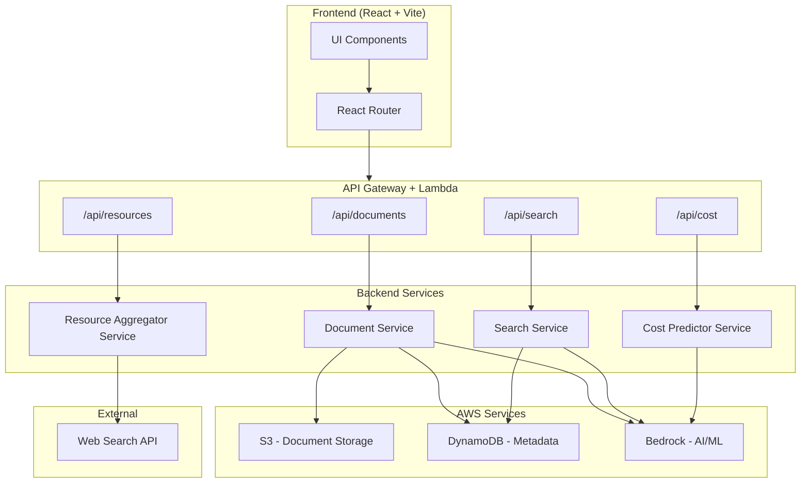

# Design Document: AWS Doc Intelligence

## Overview

AWS Doc Intelligence is a web-based platform with three modules — Document Analyzer, Resource Aggregator, and Cost Predictor — built for the "AI For Bharat" hackathon. The platform enables Indian developers to intelligently query AWS documentation, discover AWS resources across the web, and predict AWS costs for their projects.

### Tech Stack

- **Frontend**: React with TypeScript, Vite for bundling, Tailwind CSS for styling
- **Backend**: Node.js with Express, TypeScript
- **AI/ML**: Amazon Bedrock (Claude) for summarization, cost parsing, and optimization suggestions
- **Document Processing**: `pdf-parse` for PDF text extraction
- **Search**: In-memory vector search using embeddings from Amazon Bedrock (Titan Embeddings) for document search; external web search API for resource aggregation
- **Storage**: Amazon S3 for document storage (free tier: 5GB), Amazon DynamoDB for metadata (free tier: 25GB)
- **Deployment**: AWS Lambda + API Gateway (free tier: 1M requests/month)

### Design Rationale

- **Bedrock over SageMaker**: Bedrock is pay-per-use with no infrastructure management, ideal for a hackathon with cost constraints.
- **DynamoDB over RDS**: DynamoDB's free tier (25 GB, 25 WCU/RCU) is generous and requires no server management.
- **Lambda over EC2**: Lambda's free tier (1M requests, 400K GB-seconds) eliminates idle costs.
- **In-memory vector search over OpenSearch**: Avoids the cost of a managed OpenSearch cluster. For hackathon-scale data (a few documents), in-memory search is sufficient.
- **Monorepo structure**: Keeps frontend and backend in one repo for simplicity during the hackathon.

## Architecture



### Request Flow

1. User interacts with the React frontend
2. Frontend sends requests to API Gateway endpoints
3. API Gateway routes to Lambda functions
4. Lambda functions invoke backend services
5. Services interact with AWS resources (S3, DynamoDB, Bedrock) or external APIs
6. Responses flow back through the same path

## Components and Interfaces

### Frontend Components

```typescript
// Page components
LandingPage; // Module descriptions + CTAs
DocumentAnalyzer; // Upload, search, summarize UI
ResourceAggregator; // External resource search UI
CostPredictor; // Cost specification input + results UI

// Shared components
NavBar; // Module navigation
LoadingIndicator; // Processing/query loading state
ErrorDisplay; // User-friendly error messages
SearchResultCard; // Reusable result display
```

### Backend API Interfaces

```typescript
// POST /api/documents/upload
interface UploadRequest {
  file: File; // PDF or TXT
}
interface UploadResponse {
  documentId: string;
  name: string;
  pageCount: number;
  status: "success";
}

// POST /api/documents/:documentId/search
interface DocumentSearchRequest {
  query: string;
}
interface DocumentSearchResult {
  sectionHeading: string;
  pageNumber: number;
  text: string;
  highlightedText: string;
  relevanceScore: number; // 0.0 - 1.0
}
interface DocumentSearchResponse {
  results: DocumentSearchResult[];
  suggestedTopics?: string[]; // when no results found
}

// POST /api/documents/:documentId/summarize
interface SummarizeRequest {
  sectionId?: string; // omit for full-document summary
}
interface SummarizeResponse {
  summary: string;
  references: { sectionHeading: string; pageNumber: number }[];
  wordCount: number;
}

// POST /api/resources/search
interface ResourceSearchRequest {
  query: string;
}
interface SearchResult {
  title: string;
  sourceUrl: string;
  snippet: string;
  resourceType: "blog" | "video" | "article";
  relevanceScore: number;
}
interface ResourceSearchResponse {
  results: SearchResult[];
  suggestedTerms?: string[]; // when no results found
}

// POST /api/cost/predict
interface CostPredictionRequest {
  specification: string; // natural language
}
interface IdentifiedService {
  serviceName: string;
  estimatedMonthlyCost: number;
  freeTier: {
    eligible: boolean;
    limits: string;
    duration: string;
    restrictions: string;
  };
  optimizationSuggestions: {
    suggestion: string;
    estimatedSavings: number;
  }[];
}
interface CostPredictionResponse {
  services: IdentifiedService[];
  totalEstimatedMonthlyCost: number;
}
```

### Backend Service Interfaces

```typescript
// Document Service
interface IDocumentService {
  upload(
    file: Buffer,
    filename: string,
    mimeType: string,
  ): Promise<UploadResponse>;
  getDocument(documentId: string): Promise<DocumentMetadata>;
}

// Search Service
interface ISearchService {
  searchDocument(
    documentId: string,
    query: string,
  ): Promise<DocumentSearchResponse>;
  summarizeDocument(
    documentId: string,
    sectionId?: string,
  ): Promise<SummarizeResponse>;
}

// Resource Aggregator Service
interface IResourceAggregatorService {
  search(query: string): Promise<ResourceSearchResponse>;
}

// Cost Predictor Service
interface ICostPredictorService {
  predict(specification: string): Promise<CostPredictionResponse>;
}
```

## Data Models

### DynamoDB Tables

**Documents Table**
| Attribute | Type | Description |
|-----------|------|-------------|
| documentId (PK) | String | UUID |
| name | String | Original filename |
| pageCount | Number | Number of pages |
| format | String | "pdf" or "txt" |
| s3Key | String | S3 object key |
| sections | List | Parsed sections with headings, page numbers, text |
| embeddings | List | Vector embeddings for each section |
| uploadedAt | String | ISO 8601 timestamp |

**Section Schema (nested)**

```typescript
interface DocumentSection {
  sectionId: string;
  heading: string;
  pageNumber: number;
  text: string;
  embedding: number[]; // vector from Bedrock Titan
}
```

### S3 Storage

- Bucket: `aws-doc-intelligence-uploads`
- Key pattern: `documents/{documentId}/{filename}`
- Lifecycle: Objects expire after 7 days (hackathon scope)

### Validation Rules

| Field              | Rule                                      |
| ------------------ | ----------------------------------------- |
| file format        | Must be `application/pdf` or `text/plain` |
| file size (pages)  | Max 100 pages for PDF                     |
| query string       | Non-empty, max 500 characters             |
| cost specification | Non-empty, max 2000 characters            |
| summary word limit | 500 words (full doc), 200 words (section) |

## Correctness Properties

_A property is a characteristic or behavior that should hold true across all valid executions of a system — essentially, a formal statement about what the system should do. Properties serve as the bridge between human-readable specifications and machine-verifiable correctness guarantees._

### Property 1: Upload round-trip preserves document content

_For any_ valid document in a supported format (PDF or TXT), uploading it to the Document Analyzer and then retrieving the stored document should yield non-empty extracted text content and a valid searchable index entry.

**Validates: Requirements 1.1, 1.2**

### Property 2: Unsupported format rejection

_For any_ file with a MIME type other than `application/pdf` or `text/plain`, the Document Analyzer should reject the upload and return an error message that lists the supported formats.

**Validates: Requirements 1.3**

### Property 3: Upload confirmation contains document metadata

_For any_ successfully parsed document, the upload response should contain the original document name and an accurate page count.

**Validates: Requirements 1.5**

### Property 4: Search results are ordered by relevance score descending

_For any_ search query (document search or resource search) that returns two or more results, each result's relevance score should be greater than or equal to the next result's relevance score.

**Validates: Requirements 2.1, 4.3**

### Property 5: Search highlights contain query terms

_For any_ document search result with highlighted text, the highlighted portions should contain at least one term from the original query.

**Validates: Requirements 2.2**

### Property 6: Document search results contain structural metadata

_For any_ document search result, the result should include a non-empty section heading and a valid page number (≥ 1).

**Validates: Requirements 2.3**

### Property 7: Summary responses include section references

_For any_ generated summary (full-document or section), the response should include at least one reference containing a section heading and page number pointing back to the source document.

**Validates: Requirements 3.4**

### Property 8: Summary word count respects limits

_For any_ full-document summary, the word count should not exceed 500 words. _For any_ section summary, the word count should not exceed 200 words.

**Validates: Requirements 3.5**

### Property 9: Resource search results contain all required fields

_For any_ resource search result, the result should contain a non-empty title, a valid source URL, a non-empty content snippet, and a resource type that is one of "blog", "video", or "article".

**Validates: Requirements 4.2**

### Property 10: Resource type filtering returns only matching types

_For any_ set of resource search results and any selected resource type filter, applying the filter should return only results whose resource type matches the selected filter, and no results of other types.

**Validates: Requirements 4.5**

### Property 11: Total cost equals sum of individual service costs

_For any_ cost prediction response containing one or more identified services, the `totalEstimatedMonthlyCost` should equal the sum of all individual service `estimatedMonthlyCost` values.

**Validates: Requirements 5.2**

### Property 12: Free tier info is complete for all identified services

_For any_ identified service in a cost prediction response, the service should include free tier information with eligibility status, usage limits, and duration. If the service is free-tier eligible, the restrictions field should be non-empty.

**Validates: Requirements 5.3, 5.4**

### Property 13: Optimization suggestions include estimated savings

_For any_ cost optimization suggestion in a cost prediction response, the suggestion should contain a non-empty suggestion text and a positive `estimatedSavings` value.

**Validates: Requirements 6.1, 6.2**

### Property 14: Free tier is prioritized as first optimization suggestion

_For any_ identified service that is free-tier eligible and has optimization suggestions, the first suggestion should reference the free tier configuration.

**Validates: Requirements 6.3**

### Property 15: Error messages do not expose internal details

_For any_ error response returned to the user (whether from AWS service failures, timeouts, or unexpected errors), the user-facing message should not contain stack traces, file paths, internal service names, or exception class names.

**Validates: Requirements 8.1, 8.3**

## Error Handling

### Error Categories

| Category            | Source                                               | User Message                                                      | Internal Action                                    |
| ------------------- | ---------------------------------------------------- | ----------------------------------------------------------------- | -------------------------------------------------- |
| Validation Error    | Invalid file format, oversized document, empty query | Specific message describing the issue and how to fix it           | Log warning                                        |
| AWS Service Error   | S3, DynamoDB, Bedrock unavailable                    | "Service temporarily unavailable. Please retry in a few moments." | Log error with service name, request ID, timestamp |
| Network Timeout     | External web search API timeout                      | "Search timed out. Please try again."                             | Retry once, then log timeout with endpoint         |
| AI Processing Error | Bedrock returns malformed response                   | "Unable to process your request. Please try again."               | Log full Bedrock response for debugging            |
| Unexpected Error    | Unhandled exceptions                                 | "Something went wrong. Please try again later."                   | Log full stack trace, error context                |

### Error Response Format

```typescript
interface ErrorResponse {
  error: {
    code: string; // e.g., "UNSUPPORTED_FORMAT", "DOCUMENT_TOO_LARGE"
    message: string; // User-friendly message
    retryable: boolean; // Whether the user should retry
  };
}
```

### Retry Strategy

- Resource Aggregator: Retry once on network timeout (as per Requirement 8.2)
- Bedrock calls: Retry once with exponential backoff on throttling (429)
- S3/DynamoDB: No automatic retry (AWS SDK handles retries internally)

### Error Sanitization

All error responses pass through a sanitization layer that:

1. Strips stack traces and internal paths
2. Replaces internal service names with generic descriptions
3. Ensures no AWS account IDs, ARNs, or credentials leak to the client

## Testing Strategy

### Dual Testing Approach

This project uses both unit tests and property-based tests for comprehensive coverage.

- **Unit tests**: Verify specific examples, edge cases, integration points, and error conditions
- **Property-based tests**: Verify universal properties across randomly generated inputs

### Property-Based Testing Configuration

- **Library**: [fast-check](https://github.com/dubzzz/fast-check) for TypeScript
- **Minimum iterations**: 100 per property test
- **Tag format**: Each property test must include a comment referencing the design property:
  ```
  // Feature: aws-doc-intelligence, Property {number}: {property_text}
  ```
- Each correctness property from the design document must be implemented by a single property-based test

### Unit Test Scope

Unit tests should focus on:

- Specific examples demonstrating correct behavior (e.g., uploading a known PDF and verifying extracted text)
- Edge cases: empty documents, 100-page boundary, empty search queries
- Error conditions: unsupported formats, Bedrock failures, network timeouts
- Integration points: S3 upload/download, DynamoDB read/write, Bedrock prompt/response

### Property Test Scope

Property tests cover all 15 correctness properties defined above. Key generators needed:

- Random valid documents (PDF/TXT with random text content and page counts 1-100)
- Random search queries (non-empty strings up to 500 chars)
- Random `SearchResult` objects with valid fields
- Random `CostPredictionResponse` objects with valid service structures
- Random error objects (with stack traces, paths, ARNs) to test sanitization

### Test Framework

- **Test runner**: Vitest
- **Property testing**: fast-check
- **Mocking**: Vitest built-in mocks for AWS SDK clients
- **Coverage target**: All backend service functions and API route handlers
