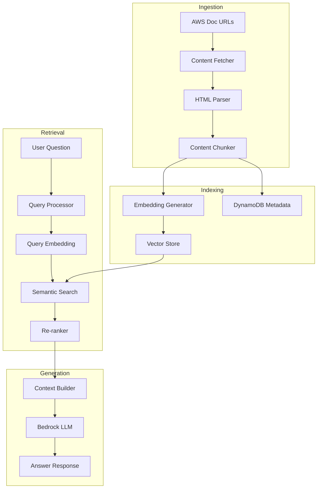
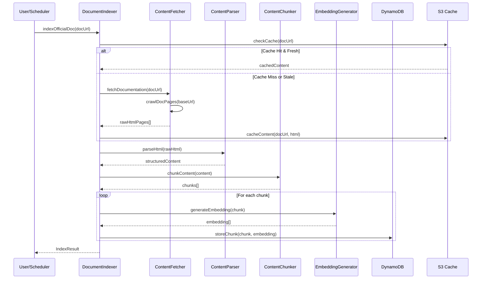
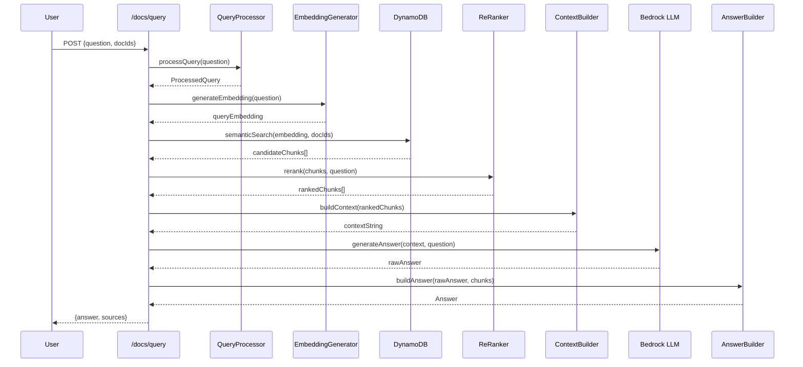

# Design Document: AWS Documentation RAG System

## Overview

This design document describes the implementation of a Retrieval-Augmented Generation (RAG) system for the Documentation Navigator feature. The system will fetch real content from official AWS documentation URLs, chunk and embed the content for semantic search, and use Amazon Bedrock to generate accurate answers based on retrieved context.

The current implementation uses placeholder text for AWS documentation. This design transforms it into a production-ready RAG pipeline that fetches, indexes, retrieves, and generates answers from actual AWS documentation content.

## Architecture

The RAG system follows a standard retrieval-augmented generation pattern with four main phases: Content Ingestion, Indexing, Retrieval, and Generation.




## Sequence Diagrams

### Document Ingestion Flow



### Question Answering Flow




## Components and Interfaces

### Component 1: ContentFetcher

**Purpose**: Fetches real HTML content from AWS documentation URLs, handles pagination, and manages rate limiting.

**Interface**:
```typescript
interface ContentFetcher {
  fetchDocumentation(baseUrl: string): Promise<FetchedPage[]>;
  fetchPage(url: string): Promise<FetchedPage>;
  crawlDocPages(baseUrl: string, maxPages?: number): Promise<FetchedPage[]>;
}

interface FetchedPage {
  url: string;
  html: string;
  title: string;
  fetchedAt: Date;
  statusCode: number;
}
```

**Responsibilities**:
- Fetch HTML content from AWS documentation URLs
- Crawl linked pages within the same documentation guide
- Handle rate limiting and retries
- Respect robots.txt and AWS terms of service

### Component 2: ContentParser

**Purpose**: Parses HTML content into structured sections, extracting text, code blocks, and metadata.

**Interface**:
```typescript
interface ContentParser {
  parseHtml(html: string, url: string): ParsedDocument;
  extractSections(document: ParsedDocument): ParsedSection[];
  extractCodeBlocks(html: string): CodeBlock[];
}

interface ParsedDocument {
  title: string;
  url: string;
  sections: ParsedSection[];
  codeBlocks: CodeBlock[];
  metadata: DocumentMetadata;
}

interface ParsedSection {
  id: string;
  title: string;
  content: string;
  level: number;
  parentId?: string;
  codeBlocks: CodeBlock[];
}

interface CodeBlock {
  language: string;
  code: string;
  context: string;
}

interface DocumentMetadata {
  lastUpdated?: string;
  service: string;
  category: string;
}
```

**Responsibilities**:
- Parse AWS documentation HTML structure
- Extract section hierarchy (h1, h2, h3, etc.)
- Identify and extract code examples
- Clean and normalize text content


### Component 3: ContentChunker

**Purpose**: Splits parsed content into optimal chunks for embedding and retrieval.

**Interface**:
```typescript
interface ContentChunker {
  chunkDocument(document: ParsedDocument): Chunk[];
  chunkSection(section: ParsedSection): Chunk[];
  mergeSmallChunks(chunks: Chunk[]): Chunk[];
}

interface Chunk {
  chunkId: string;
  docId: string;
  sectionId: string;
  content: string;
  tokenCount: number;
  metadata: ChunkMetadata;
}

interface ChunkMetadata {
  sectionTitle: string;
  sectionNumber: string;
  parentSections: SectionReference[];
  hasCode: boolean;
  codeLanguages: string[];
  startOffset: number;
  endOffset: number;
}

interface ChunkingConfig {
  maxTokens: number;        // Default: 512
  overlapTokens: number;    // Default: 50
  minChunkTokens: number;   // Default: 100
  preserveCodeBlocks: boolean;
}
```

**Responsibilities**:
- Split content into semantically meaningful chunks
- Maintain context with overlapping windows
- Preserve code blocks as atomic units
- Track chunk positions for source attribution

### Component 4: EmbeddingGenerator

**Purpose**: Generates vector embeddings for chunks and queries using Amazon Bedrock Titan.

**Interface**:
```typescript
interface EmbeddingGenerator {
  generateEmbedding(text: string): Promise<number[]>;
  generateBatchEmbeddings(texts: string[]): Promise<number[][]>;
  getEmbeddingDimension(): number;
}

interface EmbeddingConfig {
  modelId: string;          // Default: "amazon.titan-embed-text-v2:0"
  dimension: number;        // Default: 1024
  batchSize: number;        // Default: 25
  maxRetries: number;       // Default: 3
}
```

**Responsibilities**:
- Generate embeddings via Bedrock Titan Embed
- Handle batching for efficiency
- Implement retry logic with exponential backoff
- Normalize embeddings for cosine similarity


### Component 5: VectorStore (DynamoDB + OpenSearch Serverless)

**Purpose**: Stores and retrieves chunk embeddings for semantic search.

**Interface**:
```typescript
interface VectorStore {
  storeChunk(chunk: Chunk, embedding: number[]): Promise<void>;
  storeBatch(items: Array<{chunk: Chunk; embedding: number[]}>): Promise<void>;
  semanticSearch(queryEmbedding: number[], options: SearchOptions): Promise<SearchResult[]>;
  deleteByDocId(docId: string): Promise<void>;
}

interface SearchOptions {
  docIds?: string[];
  topK: number;             // Default: 20
  minScore: number;         // Default: 0.5
  includeMetadata: boolean;
}

interface SearchResult {
  chunkId: string;
  docId: string;
  content: string;
  score: number;
  metadata: ChunkMetadata;
}
```

**Responsibilities**:
- Store embeddings with metadata in DynamoDB
- Perform approximate nearest neighbor (ANN) search
- Filter by document IDs
- Support hybrid search (semantic + keyword)

### Component 6: ReRanker

**Purpose**: Re-ranks retrieved chunks using cross-encoder scoring for improved relevance.

**Interface**:
```typescript
interface ReRanker {
  rerank(chunks: SearchResult[], query: string): Promise<RankedResult[]>;
  computeCrossEncoderScore(chunk: string, query: string): Promise<number>;
}

interface RankedResult extends SearchResult {
  rerankScore: number;
  combinedScore: number;
}

interface RerankConfig {
  modelId: string;          // Bedrock model for reranking
  topK: number;             // Number of results to return after reranking
  weightSemantic: number;   // Weight for semantic score (default: 0.4)
  weightRerank: number;     // Weight for rerank score (default: 0.6)
}
```

**Responsibilities**:
- Score query-chunk pairs using cross-encoder
- Combine semantic and rerank scores
- Return top-K most relevant chunks


### Component 7: ContextBuilder

**Purpose**: Assembles retrieved chunks into an optimal context window for the LLM.

**Interface**:
```typescript
interface ContextBuilder {
  buildContext(chunks: RankedResult[], query: ProcessedQuery): BuiltContext;
  formatChunkForContext(chunk: RankedResult): string;
  estimateTokens(text: string): number;
}

interface BuiltContext {
  contextString: string;
  includedChunks: RankedResult[];
  totalTokens: number;
  truncated: boolean;
}

interface ContextConfig {
  maxContextTokens: number;  // Default: 4000
  chunkSeparator: string;    // Default: "\n\n---\n\n"
  includeMetadata: boolean;  // Include section titles, etc.
}
```

**Responsibilities**:
- Assemble chunks into coherent context
- Respect token limits
- Include source attribution metadata
- Deduplicate overlapping content

### Component 8: RAGAnswerGenerator

**Purpose**: Generates answers using Bedrock LLM with retrieved context.

**Interface**:
```typescript
interface RAGAnswerGenerator {
  generateAnswer(context: BuiltContext, query: ProcessedQuery): Promise<GeneratedAnswer>;
  buildPrompt(context: string, question: string): string;
}

interface GeneratedAnswer {
  answer: string;
  confidence: number;
  citations: Citation[];
  followUpQuestions: string[];
}

interface Citation {
  chunkId: string;
  docTitle: string;
  sectionTitle: string;
  excerpt: string;
}

interface GeneratorConfig {
  modelId: string;           // Default: "anthropic.claude-3-haiku-20240307-v1:0"
  maxTokens: number;         // Default: 1024
  temperature: number;       // Default: 0.3
  systemPrompt: string;
}
```

**Responsibilities**:
- Construct RAG prompts with context
- Call Bedrock for answer generation
- Extract citations from response
- Generate follow-up questions


## Data Models

### Model 1: DocumentChunk (DynamoDB)

```typescript
interface DocumentChunkRecord {
  // Partition Key
  docId: string;              // e.g., "aws-lambda-developer-guide"
  // Sort Key
  chunkId: string;            // e.g., "chunk-001-sec-2.3"
  
  // Content
  content: string;            // Chunk text content
  embedding: number[];        // Vector embedding (1024 dimensions)
  
  // Metadata
  sectionId: string;
  sectionTitle: string;
  sectionNumber: string;
  parentSections: SectionReference[];
  
  // Code tracking
  hasCode: boolean;
  codeLanguages: string[];
  codeBlocks: CodeBlock[];
  
  // Position tracking
  tokenCount: number;
  startOffset: number;
  endOffset: number;
  
  // Timestamps
  indexedAt: string;          // ISO timestamp
  sourceUrl: string;          // Original AWS doc URL
}
```

**Validation Rules**:
- `docId` must be non-empty and follow kebab-case format
- `chunkId` must be unique within a document
- `content` must be between 100 and 2000 tokens
- `embedding` must have exactly 1024 dimensions
- `tokenCount` must match actual token count of content

### Model 2: DocumentIndex (DynamoDB)

```typescript
interface DocumentIndexRecord {
  // Partition Key
  docId: string;
  // Sort Key
  indexVersion: string;       // e.g., "v1", "v2"
  
  // Document info
  title: string;
  category: string;
  sourceUrl: string;
  
  // Index stats
  totalChunks: number;
  totalSections: number;
  totalTokens: number;
  
  // Status
  status: 'indexing' | 'ready' | 'failed' | 'stale';
  lastIndexedAt: string;
  lastCheckedAt: string;
  contentHash: string;        // For change detection
  
  // Error tracking
  errors?: string[];
}
```

**Validation Rules**:
- `status` must be one of the defined enum values
- `totalChunks` must be positive when status is 'ready'
- `contentHash` must be SHA-256 hex string


### Model 3: ContentCache (S3)

```typescript
interface CachedContent {
  // S3 Key: docs-cache/{docId}/{contentHash}.json
  docId: string;
  sourceUrl: string;
  
  // Raw content
  pages: CachedPage[];
  
  // Metadata
  fetchedAt: string;
  expiresAt: string;          // TTL for cache validity
  contentHash: string;
  totalPages: number;
}

interface CachedPage {
  url: string;
  html: string;
  title: string;
  fetchedAt: string;
}
```

**Validation Rules**:
- Cache TTL default: 24 hours
- Maximum pages per document: 500
- Maximum HTML size per page: 5MB

## Algorithmic Pseudocode

### Main Indexing Algorithm

```typescript
ALGORITHM indexAwsDocument(docUrl: string, docId: string)
INPUT: docUrl - AWS documentation base URL, docId - unique document identifier
OUTPUT: IndexResult with success status and statistics

BEGIN
  ASSERT docUrl is valid URL starting with "https://docs.aws.amazon.com/"
  ASSERT docId is non-empty kebab-case string
  
  // Step 1: Check cache for existing content
  cachedContent ← contentCache.get(docId)
  
  IF cachedContent IS NOT NULL AND NOT isExpired(cachedContent) THEN
    pages ← cachedContent.pages
  ELSE
    // Step 2: Fetch fresh content from AWS
    pages ← contentFetcher.crawlDocPages(docUrl, maxPages: 100)
    
    ASSERT pages.length > 0, "No pages fetched"
    
    // Cache the fetched content
    contentCache.store(docId, pages, ttl: 24h)
  END IF
  
  // Step 3: Parse HTML into structured content
  parsedSections ← []
  FOR each page IN pages DO
    ASSERT page.html is non-empty
    
    parsed ← contentParser.parseHtml(page.html, page.url)
    parsedSections.addAll(parsed.sections)
  END FOR
  
  // Step 4: Chunk the content
  chunks ← []
  FOR each section IN parsedSections DO
    sectionChunks ← contentChunker.chunkSection(section)
    chunks.addAll(sectionChunks)
  END FOR
  
  ASSERT chunks.length > 0, "No chunks generated"
  
  // Step 5: Generate embeddings and store
  FOR each chunk IN chunks DO
    ASSERT chunk.tokenCount >= 100 AND chunk.tokenCount <= 2000
    
    embedding ← embeddingGenerator.generateEmbedding(chunk.content)
    
    ASSERT embedding.length === 1024
    
    vectorStore.storeChunk(chunk, embedding)
  END FOR
  
  // Step 6: Update document index
  documentIndex.update(docId, {
    status: 'ready',
    totalChunks: chunks.length,
    lastIndexedAt: now()
  })
  
  RETURN IndexResult {
    docId,
    success: true,
    chunksIndexed: chunks.length
  }
END
```

**Preconditions:**
- AWS documentation URL is accessible
- Bedrock embedding model is available
- DynamoDB tables exist and are accessible

**Postconditions:**
- All chunks are stored with embeddings
- Document index is updated to 'ready' status
- Content is cached for future use

**Loop Invariants:**
- All processed sections produce at least one chunk
- All chunks have valid embeddings before storage


### Semantic Search Algorithm

```typescript
ALGORITHM semanticSearch(query: string, docIds: string[], topK: number)
INPUT: query - user question, docIds - documents to search, topK - max results
OUTPUT: Array of SearchResult sorted by relevance

BEGIN
  ASSERT query is non-empty string
  ASSERT topK > 0 AND topK <= 100
  
  // Step 1: Generate query embedding
  queryEmbedding ← embeddingGenerator.generateEmbedding(query)
  
  ASSERT queryEmbedding.length === 1024
  
  // Step 2: Retrieve candidate chunks from vector store
  candidates ← []
  
  IF docIds is empty THEN
    // Search all documents
    candidates ← vectorStore.searchAll(queryEmbedding, topK: topK * 2)
  ELSE
    // Search specific documents
    FOR each docId IN docIds DO
      docCandidates ← vectorStore.searchByDoc(docId, queryEmbedding, topK: topK)
      candidates.addAll(docCandidates)
    END FOR
  END IF
  
  // Step 3: Compute cosine similarity scores
  FOR each candidate IN candidates DO
    candidate.score ← cosineSimilarity(queryEmbedding, candidate.embedding)
  END FOR
  
  // Step 4: Filter by minimum score threshold
  filtered ← candidates.filter(c => c.score >= 0.5)
  
  // Step 5: Sort by score descending
  filtered.sort((a, b) => b.score - a.score)
  
  // Step 6: Return top K results
  RETURN filtered.slice(0, topK)
END
```

**Preconditions:**
- Query is a valid natural language question
- At least one document is indexed if docIds is provided

**Postconditions:**
- Results are sorted by descending relevance score
- All results have score >= 0.5
- Result count <= topK

### RAG Answer Generation Algorithm

```typescript
ALGORITHM generateRAGAnswer(question: string, docIds: string[])
INPUT: question - user's natural language question, docIds - selected documents
OUTPUT: Answer with citations and confidence score

BEGIN
  ASSERT question is non-empty string
  
  // Step 1: Process the query
  processedQuery ← queryProcessor.processQuery(question)
  
  // Step 2: Semantic search for relevant chunks
  searchResults ← semanticSearch(
    processedQuery.normalizedQuestion,
    docIds,
    topK: 20
  )
  
  IF searchResults.length === 0 THEN
    RETURN Answer {
      directAnswer: "I couldn't find relevant information in the selected documentation.",
      answerType: 'no_results',
      confidence: 0
    }
  END IF
  
  // Step 3: Re-rank results for better relevance
  rankedResults ← reRanker.rerank(searchResults, question)
  
  // Step 4: Build context from top chunks
  context ← contextBuilder.buildContext(
    rankedResults.slice(0, 5),
    processedQuery
  )
  
  ASSERT context.totalTokens <= 4000
  
  // Step 5: Generate answer with Bedrock
  prompt ← buildRAGPrompt(context.contextString, question)
  
  llmResponse ← bedrockClient.invoke({
    modelId: "anthropic.claude-3-haiku-20240307-v1:0",
    prompt: prompt,
    maxTokens: 1024,
    temperature: 0.3
  })
  
  // Step 6: Extract citations from response
  citations ← extractCitations(llmResponse, context.includedChunks)
  
  // Step 7: Build final answer
  RETURN Answer {
    directAnswer: llmResponse.text,
    answerType: determineAnswerType(processedQuery, llmResponse),
    sections: mapChunksToSections(context.includedChunks),
    codeExamples: extractCodeFromChunks(context.includedChunks),
    citations: citations,
    confidence: computeConfidence(rankedResults, llmResponse)
  }
END
```

**Preconditions:**
- At least one document is indexed
- Bedrock LLM is available

**Postconditions:**
- Answer includes source citations
- Confidence score is between 0 and 1
- Answer type matches query intent


## Key Functions with Formal Specifications

### Function 1: fetchDocumentation()

```typescript
async function fetchDocumentation(baseUrl: string): Promise<FetchedPage[]>
```

**Preconditions:**
- `baseUrl` is a valid URL starting with `https://docs.aws.amazon.com/`
- Network connectivity is available
- Rate limiter has available capacity

**Postconditions:**
- Returns array of FetchedPage objects
- Each page has non-empty `html` and valid `statusCode`
- All pages are from the same documentation guide (same URL prefix)
- Rate limit is respected (max 10 requests/second)

**Loop Invariants:**
- Visited URLs set contains all processed URLs
- Queue contains only unvisited URLs within the same guide

### Function 2: chunkSection()

```typescript
function chunkSection(section: ParsedSection, config: ChunkingConfig): Chunk[]
```

**Preconditions:**
- `section.content` is non-empty string
- `config.maxTokens` > `config.minChunkTokens`
- `config.overlapTokens` < `config.maxTokens`

**Postconditions:**
- Each chunk has `tokenCount` between `minChunkTokens` and `maxTokens`
- Adjacent chunks overlap by approximately `overlapTokens`
- Code blocks are not split across chunks
- All content from section is included in at least one chunk

### Function 3: generateEmbedding()

```typescript
async function generateEmbedding(text: string): Promise<number[]>
```

**Preconditions:**
- `text` is non-empty string with length <= 8000 characters
- Bedrock Titan Embed model is accessible

**Postconditions:**
- Returns array of exactly 1024 floating-point numbers
- Each value is normalized (L2 norm of vector ≈ 1)
- Semantically similar texts produce similar embeddings

### Function 4: semanticSearch()

```typescript
async function semanticSearch(
  queryEmbedding: number[],
  options: SearchOptions
): Promise<SearchResult[]>
```

**Preconditions:**
- `queryEmbedding` has exactly 1024 dimensions
- `options.topK` is positive integer <= 100
- `options.minScore` is between 0 and 1

**Postconditions:**
- Results are sorted by `score` descending
- All results have `score` >= `options.minScore`
- Result count <= `options.topK`
- If `options.docIds` provided, all results are from those documents

### Function 5: buildContext()

```typescript
function buildContext(
  chunks: RankedResult[],
  query: ProcessedQuery
): BuiltContext
```

**Preconditions:**
- `chunks` is non-empty array
- Each chunk has valid `content` and `metadata`

**Postconditions:**
- `contextString` contains content from included chunks
- `totalTokens` <= `maxContextTokens` (4000)
- `includedChunks` is subset of input chunks
- If `truncated` is true, some chunks were excluded due to token limit


## Example Usage

### Example 1: Indexing a Document

```typescript
// Initialize components
const contentFetcher = new ContentFetcher({ rateLimit: 10 });
const contentParser = new ContentParser();
const contentChunker = new ContentChunker({ maxTokens: 512, overlapTokens: 50 });
const embeddingGenerator = new EmbeddingGenerator({ modelId: "amazon.titan-embed-text-v2:0" });
const vectorStore = new VectorStore();

// Index AWS Lambda documentation
const docUrl = "https://docs.aws.amazon.com/lambda/";
const docId = "aws-lambda-developer-guide";

const pages = await contentFetcher.crawlDocPages(docUrl, { maxPages: 100 });
const parsedDoc = contentParser.parseHtml(pages[0].html, pages[0].url);
const chunks = contentChunker.chunkDocument(parsedDoc);

for (const chunk of chunks) {
  const embedding = await embeddingGenerator.generateEmbedding(chunk.content);
  await vectorStore.storeChunk(chunk, embedding);
}

console.log(`Indexed ${chunks.length} chunks for ${docId}`);
```

### Example 2: Answering a Question

```typescript
// User asks a question
const question = "How do I give Lambda permission to read from S3?";
const selectedDocs = ["aws-lambda-developer-guide", "aws-iam-user-guide"];

// Process query
const processedQuery = queryProcessor.processQuery(question);
// { awsServices: ["Lambda", "S3"], concepts: ["permission", "IAM"], queryType: "HOW_TO" }

// Semantic search
const queryEmbedding = await embeddingGenerator.generateEmbedding(question);
const searchResults = await vectorStore.semanticSearch(queryEmbedding, {
  docIds: selectedDocs,
  topK: 20,
  minScore: 0.5
});

// Re-rank and build context
const rankedResults = await reRanker.rerank(searchResults, question);
const context = contextBuilder.buildContext(rankedResults.slice(0, 5), processedQuery);

// Generate answer
const answer = await ragAnswerGenerator.generateAnswer(context, processedQuery);

console.log(answer.directAnswer);
// "To give Lambda permission to read from S3, you need to:
//  1. Create an IAM execution role for your Lambda function
//  2. Attach a policy that grants s3:GetObject permission..."

console.log(answer.citations);
// [{ docTitle: "AWS Lambda Developer Guide", sectionTitle: "Execution Role", excerpt: "..." }]
```

### Example 3: Incremental Sync

```typescript
// Check for documentation updates
const docIndex = await documentIndex.get("aws-lambda-developer-guide");

if (isStale(docIndex.lastCheckedAt, 24 * 60 * 60 * 1000)) {
  // Fetch latest content
  const latestPages = await contentFetcher.fetchDocumentation(docIndex.sourceUrl);
  const latestHash = computeContentHash(latestPages);
  
  if (latestHash !== docIndex.contentHash) {
    // Content changed, re-index
    await documentIndexer.reindexDocument(docIndex.docId, latestPages);
    console.log(`Re-indexed ${docIndex.docId} due to content changes`);
  } else {
    // No changes, just update check timestamp
    await documentIndex.updateLastChecked(docIndex.docId);
  }
}
```


## Correctness Properties

*A property is a characteristic or behavior that should hold true across all valid executions of a system-essentially, a formal statement about what the system should do. Properties serve as the bridge between human-readable specifications and machine-verifiable correctness guarantees.*

### Property 1: Chunk Coverage

*For any* document and any text segment within that document, the text segment appears in at least one chunk of the document's index.

**Validates: Requirements 4.5**

### Property 2: Chunk Structure Validity

*For any* chunk produced by the Content_Chunker, the chunk has a token count between the configured minimum and maximum limits, and includes metadata with section title, section number, and parent section references.

**Validates: Requirements 4.1, 4.4**

### Property 3: Code Block Preservation

*For any* content containing code blocks, when chunked, each code block appears complete and unsplit in exactly one chunk.

**Validates: Requirements 4.3**

### Property 4: Embedding Determinism

*For any* text input, calling generateEmbedding with identical input text produces identical embedding vectors.

**Validates: Requirements 5.5**

### Property 5: Embedding Dimension Consistency

*For any* embedding generated by the Embedding_Generator, the embedding vector has exactly 1024 dimensions.

**Validates: Requirements 5.2**

### Property 6: Search Result Ordering

*For any* semantic search query, the returned results are sorted by similarity score in descending order.

**Validates: Requirements 7.3**

### Property 7: Search Result Constraints

*For any* semantic search with specified options, all returned results satisfy: (a) if docIds are specified, results are only from those documents, (b) all results have similarity scores at or above the minimum threshold, and (c) result count does not exceed topK.

**Validates: Requirements 7.4, 7.5, 7.6**

### Property 8: Re-rank Score Combination

*For any* re-ranked result, the combined score equals the weighted sum of the semantic similarity score and the cross-encoder re-rank score using the configured weights.

**Validates: Requirements 8.2**

### Property 9: Re-rank Result Ordering

*For any* set of re-ranked results, the results are sorted by combined score in descending order.

**Validates: Requirements 8.3**

### Property 10: Context Token Limit

*For any* built context, the total token count does not exceed the configured maximum context token limit.

**Validates: Requirements 9.3**

### Property 11: Context Truncation Indication

*For any* context building operation where chunks were excluded due to token limits, the truncated flag is set to true.

**Validates: Requirements 9.4**

### Property 12: Citation Completeness and Accuracy

*For any* citation in a generated answer, the citation includes document title, section title, chunk ID, and a relevant excerpt, and the cited excerpt exists verbatim in the source chunk content.

**Validates: Requirements 11.1, 11.2, 11.3**

### Property 13: Cache Content Hash Consistency

*For any* cached content entry that is not expired, the stored content hash matches the hash computed from the stored content.

**Validates: Requirements 2.3, 2.4**

### Property 14: Cache Hit Behavior

*For any* fetch request where a valid (non-expired) cache entry exists, the system uses the cached content without making a network request to the source.

**Validates: Requirements 2.2**

### Property 15: Fetched Page Completeness

*For any* page fetched by the Content_Fetcher, the result includes URL, HTML content, title, fetch timestamp, and status code.

**Validates: Requirements 1.6**

### Property 16: HTML Element Removal

*For any* HTML content parsed by the Content_Parser, the output does not contain navigation, footer, header, script, or style elements.

**Validates: Requirements 3.4**

### Property 17: Section Hierarchy Preservation

*For any* HTML document with heading elements, the parsed sections preserve the heading hierarchy with correct parent-child relationships matching the h1, h2, h3 structure.

**Validates: Requirements 3.2**

### Property 18: Document Index Status Consistency

*For any* document that completes indexing successfully, the document index status is set to ready with a positive chunk count.

**Validates: Requirements 12.2**

### Property 19: Chunk Deletion by Document ID

*For any* document ID passed to the delete operation, after deletion completes, no chunks with that document ID remain in the Vector_Store.

**Validates: Requirements 6.3**

### Property 20: Query Embedding Round Trip

*For any* search query, the system generates an embedding for the query text before performing semantic search.

**Validates: Requirements 7.1**

## Error Handling

### Error Scenario 1: AWS Documentation Unavailable

**Condition**: HTTP request to AWS docs returns 4xx/5xx or times out
**Response**: 
- Return cached content if available and not expired
- If no cache, return error with retry suggestion
- Log the failure for monitoring
**Recovery**: 
- Automatic retry with exponential backoff (3 attempts)
- Fall back to stale cache if fresh fetch fails

### Error Scenario 2: Bedrock Rate Limit Exceeded

**Condition**: Bedrock returns ThrottlingException
**Response**:
- Queue the request for retry
- Return partial results if some embeddings succeeded
- Notify user of degraded service
**Recovery**:
- Exponential backoff with jitter
- Batch requests to reduce API calls

### Error Scenario 3: Embedding Dimension Mismatch

**Condition**: Stored embedding dimension differs from query embedding
**Response**:
- Log error and skip mismatched chunks
- Return results from compatible chunks only
**Recovery**:
- Trigger re-indexing of affected documents
- Alert for manual investigation

### Error Scenario 4: Context Token Overflow

**Condition**: Top chunks exceed context window limit
**Response**:
- Truncate to fit within limit
- Mark response as potentially incomplete
- Include most relevant chunks first
**Recovery**:
- Adjust chunk selection strategy
- Consider summarization for long chunks


## Testing Strategy

### Unit Testing Approach

Test individual components in isolation with mocked dependencies:

- **ContentFetcher**: Mock HTTP responses, test URL parsing, rate limiting
- **ContentParser**: Test HTML parsing with sample AWS doc HTML
- **ContentChunker**: Test chunking logic, overlap handling, code block preservation
- **EmbeddingGenerator**: Mock Bedrock responses, test batching, error handling
- **VectorStore**: Test CRUD operations, search filtering
- **ContextBuilder**: Test token counting, truncation, deduplication

**Coverage Goals**: 80% line coverage, 100% branch coverage for critical paths

### Property-Based Testing Approach

**Property Test Library**: fast-check

Key properties to test:
1. Chunking preserves all content (no data loss)
2. Search results are always sorted by score
3. Context never exceeds token limit
4. Embeddings are deterministic for same input

### Integration Testing Approach

Test component interactions with real AWS services (in test account):

1. **End-to-end indexing**: Fetch real AWS doc page → parse → chunk → embed → store
2. **End-to-end query**: Question → search → rerank → generate → verify citations
3. **Cache behavior**: Test cache hit/miss scenarios, TTL expiration
4. **Error recovery**: Test behavior when Bedrock is unavailable

## Performance Considerations

### Indexing Performance
- Batch embedding requests (25 texts per API call)
- Parallel page fetching with rate limiting (10 req/sec)
- Incremental indexing (only re-index changed content)
- Target: Index 100-page document in < 5 minutes

### Query Performance
- Target response time: < 2 seconds for 95th percentile
- Cache query embeddings for repeated questions
- Pre-compute embeddings for common queries
- Use DynamoDB DAX for hot chunk retrieval

### Storage Optimization
- Compress embeddings (float16 instead of float32)
- Store only top-level metadata in DynamoDB, full content in S3
- TTL for stale index entries (30 days)

## Security Considerations

### Data Protection
- All data encrypted at rest (DynamoDB, S3)
- TLS 1.2+ for all API calls
- No PII stored in indexes

### Access Control
- IAM roles for Bedrock access with least privilege
- API Gateway authorization for query endpoints
- Rate limiting per user/IP

### Content Validation
- Sanitize HTML before parsing
- Validate chunk content before embedding
- Reject malformed or suspicious content

## Dependencies

### AWS Services
- **Amazon Bedrock**: Titan Embed (embeddings), Claude 3 Haiku (generation)
- **Amazon DynamoDB**: Chunk storage, document index, query history
- **Amazon S3**: Content cache, raw HTML storage
- **Amazon CloudWatch**: Metrics, logging, alarms

### NPM Packages
- `@aws-sdk/client-bedrock-runtime`: Bedrock API client
- `@aws-sdk/client-dynamodb`: DynamoDB operations
- `@aws-sdk/client-s3`: S3 operations
- `cheerio`: HTML parsing
- `tiktoken`: Token counting for context management
- `p-limit`: Concurrency control for API calls
